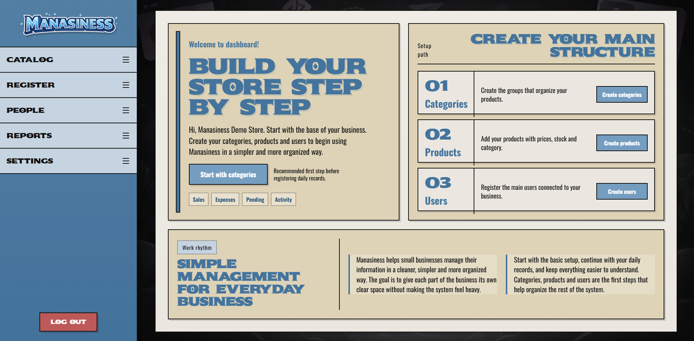
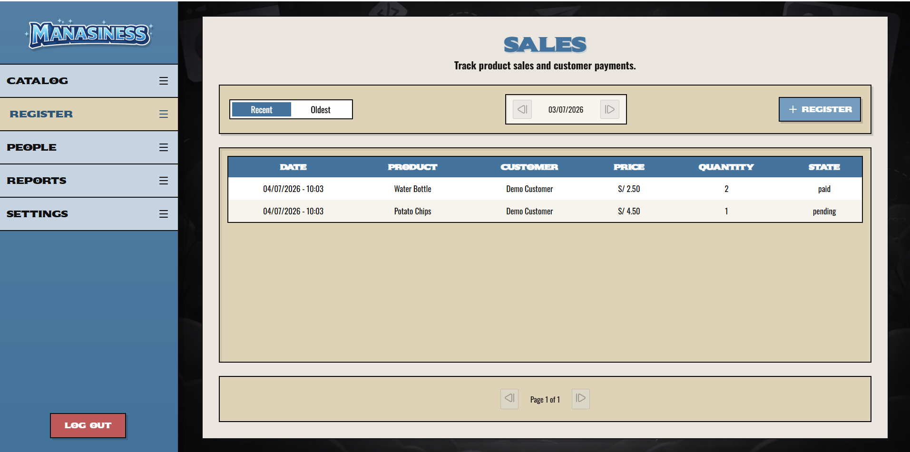
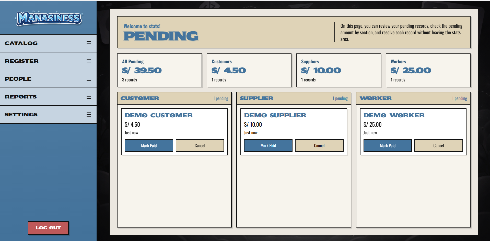
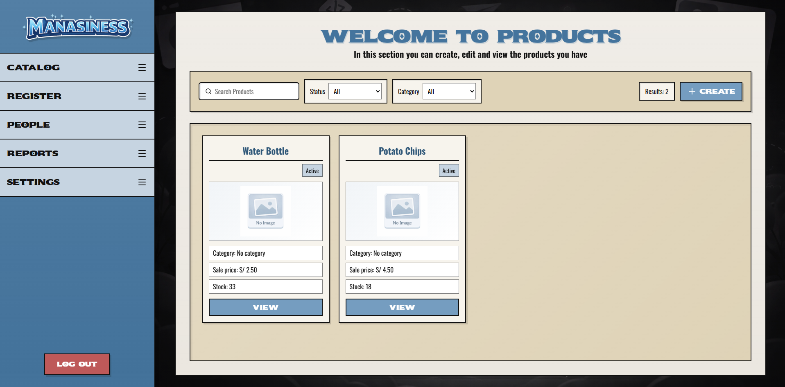
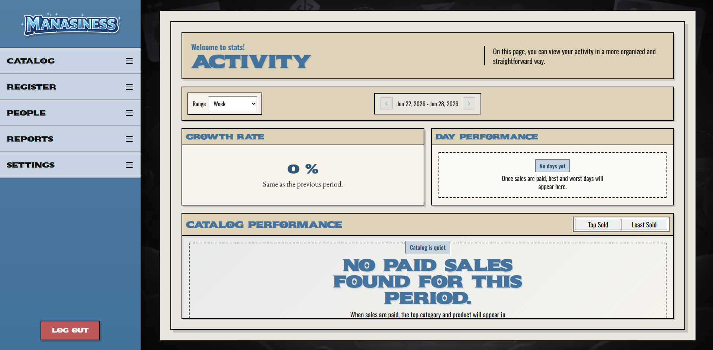

<div align="center">
  

  <h1>Manasiness</h1>

  <p>
    A full-stack business management dashboard for small stores: catalog, people,
    sales, purchases, staff payments, pending records, and financial reports.
  </p>

  <p>
    
    
    
    
    
  </p>
</div>

<p align="center">
  <a href="docs/README.md"><strong>Docs</strong></a>
  &middot;
  <a href="docs/ARCHITECTURE.md"><strong>Architecture</strong></a>
  &middot;
  <a href="docs/FRONTEND.md"><strong>Frontend</strong></a>
  &middot;
  <a href="docs/BACKEND.md"><strong>Backend</strong></a>
  &middot;
  <a href="docs/DATABASE.md"><strong>Database</strong></a>
  &middot;
  <a href="docs/SECURITY.md"><strong>Security</strong></a>
</p>

<p align="center">
  
</p>

---

## Product

Manasiness helps a small business keep daily operations organized without turning the app into a heavy ERP. It starts with the base of the store, then connects day-to-day movements and reports around the same data.

<table>
  <tr>
    <td width="50%">
      <strong>Catalog control</strong><br />
      Categories and products with images, status, prices, stock, and store-scoped data.
    </td>
    <td width="50%">
      <strong>People management</strong><br />
      Customers, suppliers, workers, and users organized through reusable card and detail screens.
    </td>
  </tr>
  <tr>
    <td width="50%">
      <strong>Daily movements</strong><br />
      Sales, orders, and staff payments with table history, date windows, sorting, and registration flows.
    </td>
    <td width="50%">
      <strong>Business reports</strong><br />
      Income, expenses, pending records, activity metrics, and chart-based summaries.
    </td>
  </tr>
  <tr>
    <td width="50%">
      <strong>Secure dashboard</strong><br />
      Protected routes, httpOnly cookie authentication, JWT validation, bcrypt, CORS, and rate limiting.
    </td>
    <td width="50%">
      <strong>Modular codebase</strong><br />
      Feature-first frontend and layered backend modules designed to stay readable as the app grows.
    </td>
  </tr>
</table>

## Screenshots

<table>
  <tr>
    <td width="50%">
      
      <strong>Sales history</strong><br />
      Daily movement table with sorting, date window controls, pagination, and registration access.
    </td>
    <td width="50%">
      
      <strong>Pending payments</strong><br />
      Global and scoped pending totals with clear actions to complete open records.
    </td>
  </tr>
  <tr>
    <td width="50%">
      
      <strong>Product catalog</strong><br />
      Search, filters, status, stock, pricing, and quick access to product details.
    </td>
    <td width="50%">
      
      <strong>Activity analytics</strong><br />
      Period filters, performance cards, and catalog activity summaries.
    </td>
  </tr>
</table>

## Stack

```text
Frontend   React 19 / Vite 8 / TypeScript / React Router / Recharts / CSS
Backend    Node.js / Express 5 / TypeScript / PostgreSQL client / JWT
Database   PostgreSQL 16 / SQL schema files / seed scripts / triggers
Security   httpOnly cookies / bcrypt / CORS credentials / rate limiting
Email      Resend
Infra      Docker Compose / frontend nginx image / PostgreSQL volume
```

## Run

<details open>
<summary><strong>Docker: full app</strong></summary>

```bash
cp .env.docker.example .env.docker
npm run docker:up
```

Open:

```text
http://localhost:8080
```

Docker starts PostgreSQL, backend, and frontend. The database schema is mounted from `backend/src/database/schema`.

The demo seed runs automatically in Docker:

```text
Email: demo@manasiness.dev
Password: 123456
```

</details>

<details>
<summary><strong>Local development</strong></summary>

Install dependencies:

```bash
npm run install:all
```

Start PostgreSQL, create the backend `.env`, then run schema and seed:

```bash
npm run db:schema
npm run db:seed
```

Run the apps:

```bash
npm run dev:backend
npm run dev:frontend
```

Default frontend URL:

```text
http://localhost:5173
```

</details>

## Validation

```bash
npm run validate
```

## Documentation

| Document | Purpose |
| --- | --- |
| [`docs/README.md`](docs/README.md) | Documentation index and reading order |
| [`docs/ARCHITECTURE.md`](docs/ARCHITECTURE.md) | System shape and module boundaries |
| [`docs/FRONTEND.md`](docs/FRONTEND.md) | Frontend folders, routing, cache, and UI rules |
| [`docs/BACKEND.md`](docs/BACKEND.md) | Backend modules, request flow, auth, and layering |
| [`docs/DATABASE.md`](docs/DATABASE.md) | PostgreSQL schema and data model |
| [`docs/BOOTSTRAP.md`](docs/BOOTSTRAP.md) | Dashboard bootstrap loading and cache |
| [`docs/DOCKER.md`](docs/DOCKER.md) | Docker Compose workflow and services |
| [`docs/DEVELOPMENT.md`](docs/DEVELOPMENT.md) | Local workflow and seed account |
| [`docs/SECURITY.md`](docs/SECURITY.md) | Security model and sensitive routes |
| [`docs/QA_CHECKLIST.md`](docs/QA_CHECKLIST.md) | Manual validation checklist |

## Repository

```text
backend/
  src/config/       environment, database, and CORS configuration
  src/database/     SQL schema, seed data, and database scripts
  src/modules/      auth, catalog, people, movements, reports, settings
  src/shared/       validators, mappers, email, constants, transactions

frontend/
  src/app/          routing, providers, dashboard layout
  src/features/     product areas grouped by business domain
  src/shared/       API client, storage, hooks, UI primitives, types

docs/
  architecture, backend, frontend, database, Docker, security, and QA notes
```

---

<div align="center">
  <strong>Manasiness</strong><br />
  Simple management for everyday business.
</div>
